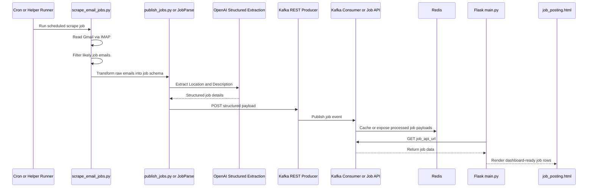

# Helper Scrapers And Job Ingestion

## Overview

The repository contains two helper scraper paths outside the main Flask application:

- `email-agent-tests/remotejob_agent.py`
- `email-agent-tests/scrape_email_jobs.py`

These are helper services and are not part of `main.py`.

This matches your instruction that the scrapers act as supporting services which push jobs to an existing Kafka producer running as a separate microservice on the same Docker network.

## Email-based job scraper

The email helper flow uses:

- `scrape_email_jobs.py` to connect to Gmail via IMAP
- multipart message parsing to extract email bodies
- keyword-based filtering for likely job mails
- `publish_jobs.py` to transform raw emails into structured job payloads
- `run_scrape_job.py` as the helper execution entrypoint

### Email parsing behavior

The email scraper:

- loads Gmail credentials from `.env`
- searches the inbox for the last 1 day
- walks email parts and prefers plain text
- falls back to HTML-derived text
- extracts sender, subject, date, snippet, and body preview

### LLM-backed shaping

Inside `email-agent-tests/publish_jobs.py`, the `JobParse` class:

- parses sender email and sender domain deterministically
- uses OpenAI structured parsing for `Location` and `Description`
- aggregates the final result into the `JobSearchEvent` schema

This means:

- `Company_Name` is sourced from the sender domain
- `Email_Address` is sourced from the sender header
- `Location` and `Description` are LLM-assisted

## Online job scraper

`email-agent-tests/remotejob_agent.py` remains a separate helper for online job discovery rather than email scraping.

Its current role is:

- query an LLM for relevant job suggestions using the candidate profile
- shape those suggestions into the same job schema
- push them to Kafka through the REST producer

## Kafka publishing path

The helper publish path uses `publish_jobs.py`.

That module:

- constructs `Application_Date`
- serializes the structured payload
- POSTs the message to `KAFKA_REST_PROXY_URL`

## Helper ingestion sequence diagram

## Scheduling and isolation

The helper service is isolated from the main app through:

- `email-agent-tests/requirements.txt`
- `email-agent-tests/docker/Dockerfile`
- `email-agent-tests/docker/start_helper_service.sh`
- the `gmail_job_helper` service in `docker-compose.yml`

The helper runs behind a Compose profile and uses a cron-style schedule, which keeps its dependencies and runtime separate from the main Flask app.
