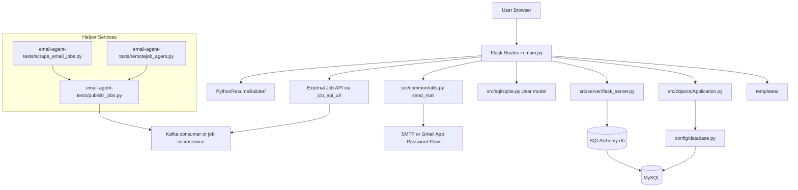

# Main Application Architecture

## Entry point

`main.py` is the central Flask entrypoint. It wires together:

- Flask route definitions
- session management through `Flask-Session`
- authentication and profile flows
- recruiter email sending
- job application persistence
- resume-builder rendering
- job dashboard rendering fed from an external job API

The file imports:

- `src.server.flask_server.app` and `db`
- `src.objects.Application`
- `src.sql.sqlite.User`
- `src.common.utils.send_mail`

## Architecture diagram

The main application acts as the user-facing orchestration layer. It renders pages, manages user state, persists application records, sends recruiter emails, and pulls job postings from an external job-serving endpoint.

## Flask bootstrap

The lower-level Flask setup lives in `src/server/flask_server.py`.

That module is responsible for:

- loading environment variables
- setting `SECRET_KEY`
- setting `SQLALCHEMY_DATABASE_URI`
- creating the shared SQLAlchemy `db` object

`main.py` then reconfigures the app for the broader runtime by:

- setting the static folder to `images/`
- enabling session storage
- enabling Swagger
- loading the environment again for route-time usage

## Main responsibilities in `main.py`

The application is split broadly into these concerns:

- authentication and session lifecycle
- profile and settings management
- manual application submission
- application history and cache management
- external job dashboard consumption
- recruiter mail sending
- resume builder rendering

## Key collaborators

`main.py` depends on the following code paths:

- `src/objects/Application.py` for application record creation, deletion, cache, and DB update
- `config/database.py` for MySQL connectivity
- `src/common/utils.py` for recruiter email sending through `yagmail`
- `templates/` for all page rendering

## Design shape

The current design keeps the user-facing application monolithic at the Flask layer, while external ingestion is delegated to helper microservice-style scripts. This gives the main app a simple interaction model, but also means `main.py` owns many responsibilities directly.
