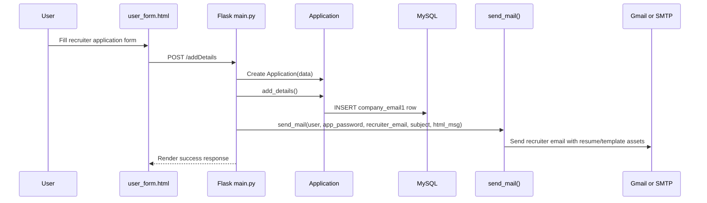
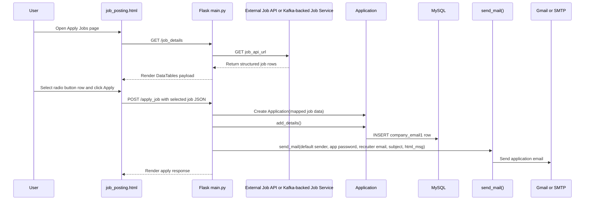

# User Flows And API Routes

## Authentication and session flow

Main authentication routes:

- `/`
- `/login`
- `/signup`
- `/logout/`
- `/password_reset`
- `/new_password`

The app uses session-based access control with a custom `login_required` decorator.

## Dashboard and navigation

After login, users land on the dashboard flow driven by:

- `/dashboard`

The dashboard template is `templates/user_form.html`, which exposes:

- manual recruiter application submission
- cache update and cache inspection
- navigation to application details
- navigation to settings and user profile
- navigation to job dashboard

## Manual apply flow

The manual apply path is:

1. user fills the form in `user_form.html`
2. POST is sent to `/addDetails`
3. an `Application` object is created
4. the row is inserted into MySQL
5. recruiter email is sent through `send_mail()`

This flow uses:

- default resume content from `docs/Resume.pdf`
- inline image content from `images/`
- recruiter details from form submission

### Manual apply sequence diagram

## Application history flow

Application viewing paths are:

- `/application_details`
- `/get_data`
- `/index_get_data`
- `/delete_form`
- `/delete`

`/index_get_data` returns row data formatted for UI tables.

## Cache management flow

The application supports a temporary in-memory cache using `Application.all_contacts`.

Related routes:

- `/check_cache`
- `/update`

This allows a user to:

- inspect cached applications
- prune selected cached entries
- bulk-flush cache to MySQL
- clear cache without persistence

## External job dashboard flow

The job dashboard is rendered through:

- `/show_jobs`
- `/job_details`
- `/apply_job`

Behavior:

- `/job_details` fetches data from `job_api_url`
- response rows are reshaped into dashboard-ready records
- `templates/job_posting.html` renders the DataTables UI
- the user selects a row through a radio button
- `/apply_job` maps the selected row into the `Application` format and sends the mail

This matches your instruction that one route of data ingestion is through automated radio-button selection from the job list dashboard.

### Dashboard apply sequence diagram

## Profile and settings flow

Supporting user-profile routes:

- `/user_profile`
- `/settings`
- `/project_details`

These flows manage:

- image upload
- resume upload
- profile upload
- Git/project metadata
- user profile rendering

## Resume builder flow

The resume builder page is exposed through:

- `/render_resume_builder`

It loads:

- `PythonResumeBuilder/resume.json`
- `PythonResumeBuilder/template.html`

and renders them inside `templates/resume_builder.html`.
